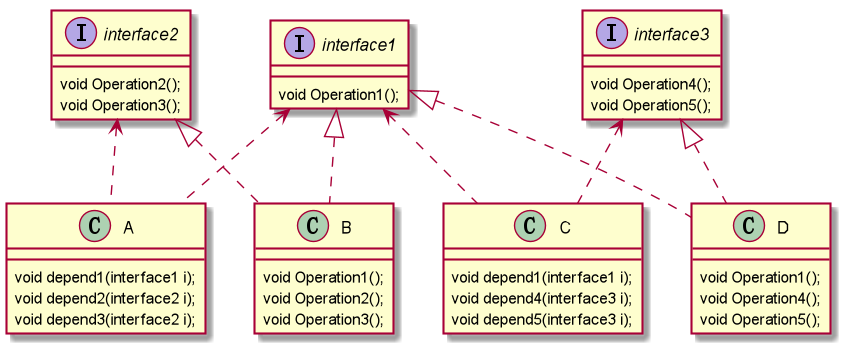

## 接口隔离原则

### 介绍：

客户端不应该依赖他不需要的接口，即**一个类对另一个类的依赖应该建立在最小的接口上**

### 示例：
 > 比较简单，就不写代码了
 
 类A通过接口 Interface1 依赖类 B ，类 C 通过接口依赖 D，如果接口 Interface1 对于类 A 和类 C 来说不是最小接口，那么类 B 和类 C 必须去实现他们不需要的方法。
 
 解决方式：
 
 将 Interface1 拆分成独立的几个接口，类 A 和类 C 分别将他们需要的接口建立依赖关系。也就是采用接口隔离原则

### 如图:
 