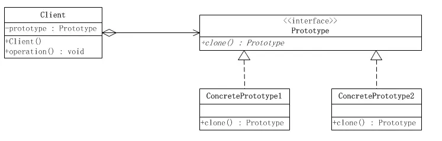

# 原型模式

原型模式属于对象的创建模式。通过给出一个原型对象来指明所有创建的对象的类型，然后用这个原型对象提供的复制办法创建出更多同类型的对象。

原型模式要求对象实现一个可以克隆自身的接口(类型)。
这样一来，通过原型实例创建新的对象，就不需要关心这个实例本身的类型，只需要实现克隆自身的方法，也而无需再去通过new来创建。

有两种：
* 简单形式
* 登记形式

相关角色：

客户(Client)角色：客户类提出创建对象的请求；
抽象原型(Prototype)角色：这是一个抽象角色，通常由一个Java接口或者Java抽象类实现。此角色定义了的具体原型类所需的实现的方法。
具体原型(Concrete Prototype)角色：此角色需要实现抽象原型角色要求的克隆相关的接口。
