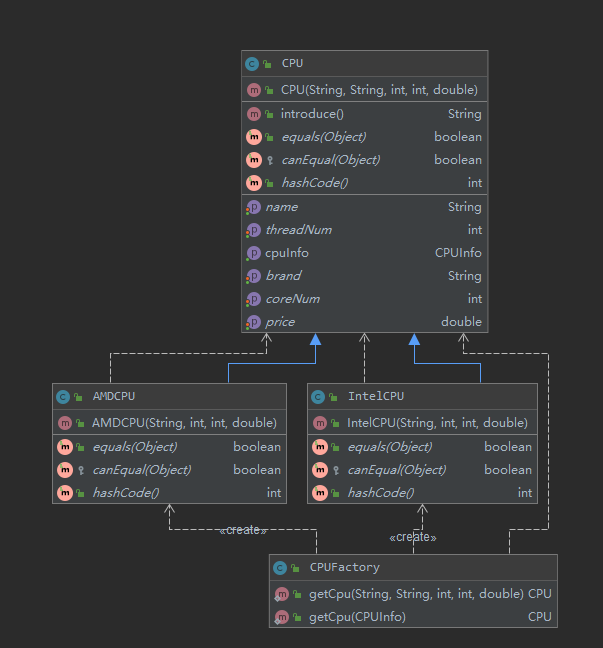
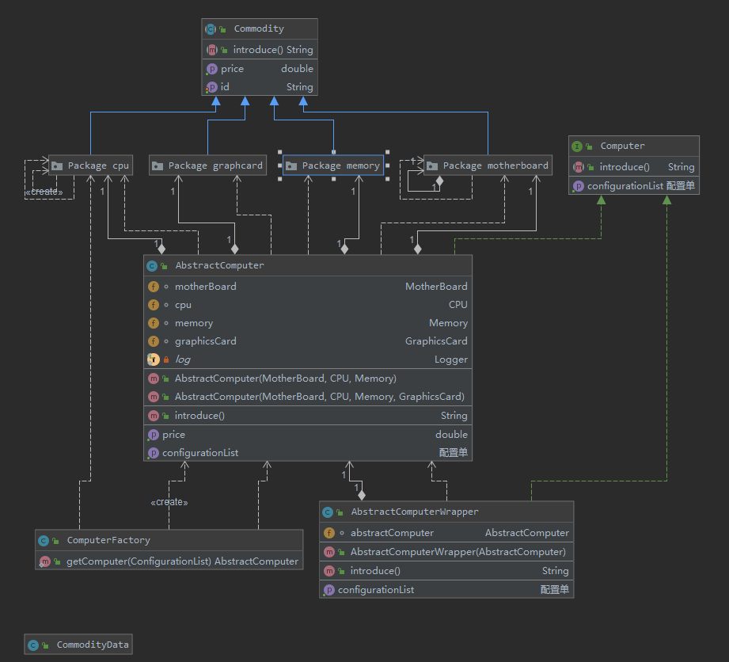
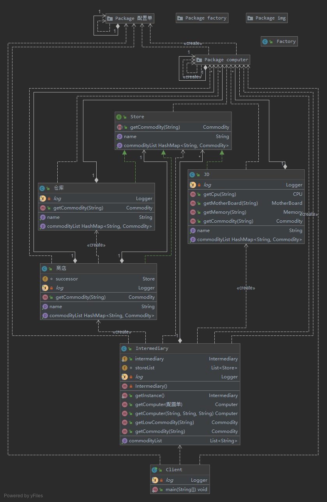
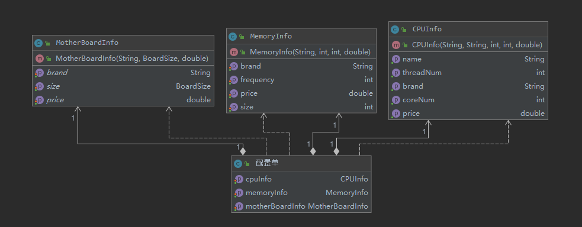

# 作业描述

设想一个场景，尽可能多的使用1~n个设计模式

1. 形式不限，web项目、main函数都可以
2. 文档输出：
    * 列举使用到的设计模式，并谈谈自己的看法
    * 为什么使用，其必要性和好处

使用了

工厂模式，包装器模式，单例模式，组合模式，备忘录模式，中介模式，责任链模式

场景偏小，时间少，否则能用更多的设计模式

设计模式使得我的代码膨胀累很多，但是对添加功能变得友好（哪里友好，例如？）

但是使用的时候，不能生搬硬套设计模式，设计模式可以看做 二十三种用法
，我觉得，只要遵循七大原则，基本上写出来的代码就算可以了。

为什么要使用：

从设计模式的定义：

> 在软件开发领域，经过*验证的*，用于解决在*特定环境下*，*重复出现的*特定问题的*解决方案*！
         
1. 这是前辈的编程经验，值得学习，免得自己走弯路

2. 避免重复研发轮子

3. 易于维护（该需求，扩展，易懂 等）

4. 写出高质量的代码必须要有的东西

这里是作业文档。

需要用尽可能多的设计模式，

## 需求概述：

### 场景一：

CPU有不同的厂家，不同的规格，因此使用了*工厂方法*模式，类图如下

### 场景二
电脑的构成比较负责，需要多个部件，因此使用*组合模式*。

同时，给电脑包装了一层，方便改装（例如，加灯，改装水冷。。。）
此处用到了 *包装器模式*

### 场景三

获取CPU配件的渠道多种多样，可以从商店，京东等地方获取

商店还有个仓库，可以在商店内没有商品的情况下，去取商品

这里用到了 *责任链模式*

### 场景四

对个人来说，这样购买电脑还是比较麻烦，有个中间商就好了，

因此引入了 *中介者模式*

他统一了接口，从不同的地方收集配件，组装电脑。

类图

### 场景五

每次选配置还是太麻烦，因此又引入了*备忘录模式*，记录电脑配置，这样就可以直接使用配置单配电脑

## 设计模式作业

